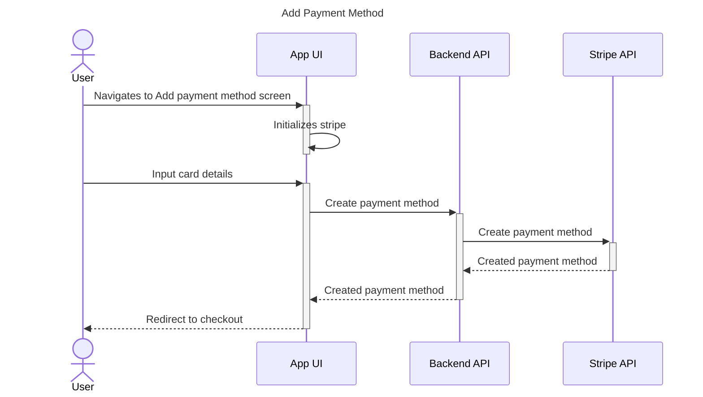

```mermaid
sequenceDiagram
    title: Add Payment Method
    actor user as User
    participant ui as App UI
    participant backend as Backend API
    participant stripe as Stripe API

    user ->>+ ui: Navigates to Add payment method screen
    ui ->>- ui: Initializes stripe
    user ->>+ ui: Input card details
    ui ->>+ backend: Create payment method
    backend ->>+ stripe: Create payment method
    stripe -->>- backend: Created payment method
    backend -->>- ui: Created payment method
    ui -->>- user: Redirect to checkout
```
