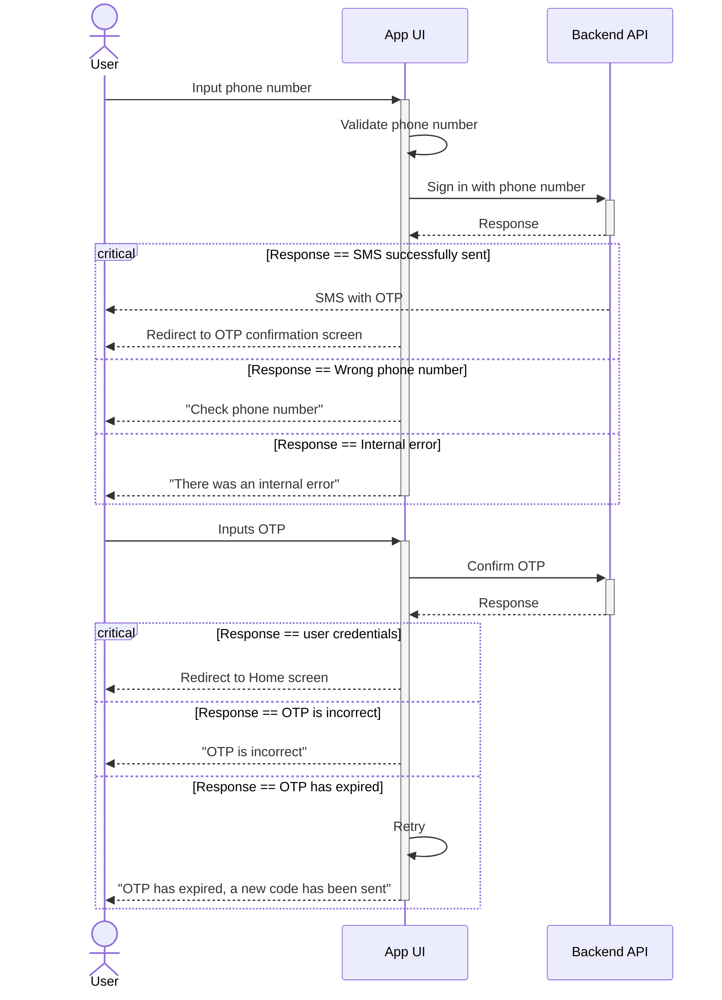

```mermaid
sequenceDiagram
    actor user as User
    participant ui as App UI
    participant backend as Backend API
    
    user ->>+ ui: Input phone number
    ui ->> ui: Validate phone number

    ui ->>+ backend: Sign in with phone number
    backend -->>- ui: Response

    critical Response == SMS successfully sent
        backend -->> user: SMS with OTP
        ui -->> user: Redirect to OTP confirmation screen
    option Response == Wrong phone number
        ui -->> user: "Check phone number"
    option Response == Internal error
        ui -->>- user: "There was an internal error"
    end

    user ->>+ ui: Inputs OTP
    ui ->>+ backend: Confirm OTP
    backend -->>- ui: Response
    critical Response == user credentials
        ui -->> user: Redirect to Home screen
    option Response == OTP is incorrect
        ui -->> user: "OTP is incorrect"
    option Response == OTP has expired
        ui ->> ui: Retry
        ui -->>- user: "OTP has expired, a new code has been sent"
    end
```