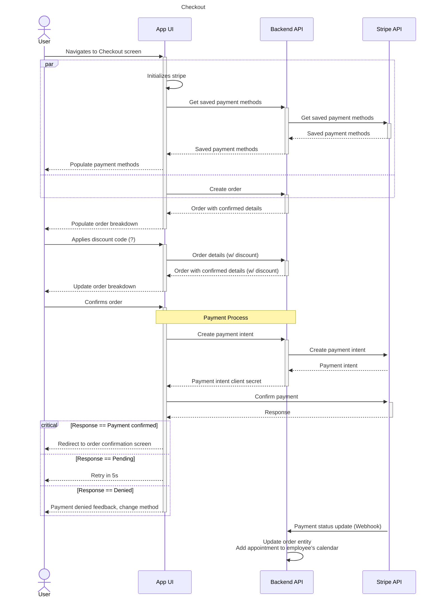

```mermaid
sequenceDiagram
    title: Checkout
    actor user as User
    participant ui as App UI
    participant backend as Backend API
    participant stripe as Stripe API

    user ->>+ ui: Navigates to Checkout screen

    par
        ui ->> ui: Initializes stripe
        ui ->>+ backend: Get saved payment methods
        backend ->>+ stripe: Get saved payment methods
        stripe -->>- backend: Saved payment methods
        backend -->>- ui: Saved payment methods
        ui -->> user: Populate payment methods
    and
        ui ->>+ backend: Create order
    end

    backend -->>- ui: Order with confirmed details
    ui -->>- user: Populate order breakdown

    user ->>+ ui: Applies discount code (?)
    ui ->>+ backend: Order details (w/ discount)
    backend -->>- ui: Order with confirmed details (w/ discount)
    ui -->>- user: Update order breakdown


    user ->>+ ui: Confirms order
    Note over ui,backend: Payment Process
    ui ->>+ backend: Create payment intent
    backend ->>+ stripe: Create payment intent
    stripe -->> backend: Payment intent
    backend -->>- ui: Payment intent client secret
    ui ->>+ stripe: Confirm payment
    stripe -->>- ui: Response

    critical Response == Payment confirmed
        ui -->> user: Redirect to order confirmation screen
    option Response == Pending
        ui -->> user: Retry in 5s
    option Response == Denied
        ui -->>- user: Payment denied feedback, change method
    end

    stripe ->> backend: Payment status update (Webhook)
    backend ->> backend: Update order entity<br>Add appointment to employee's calendar
```