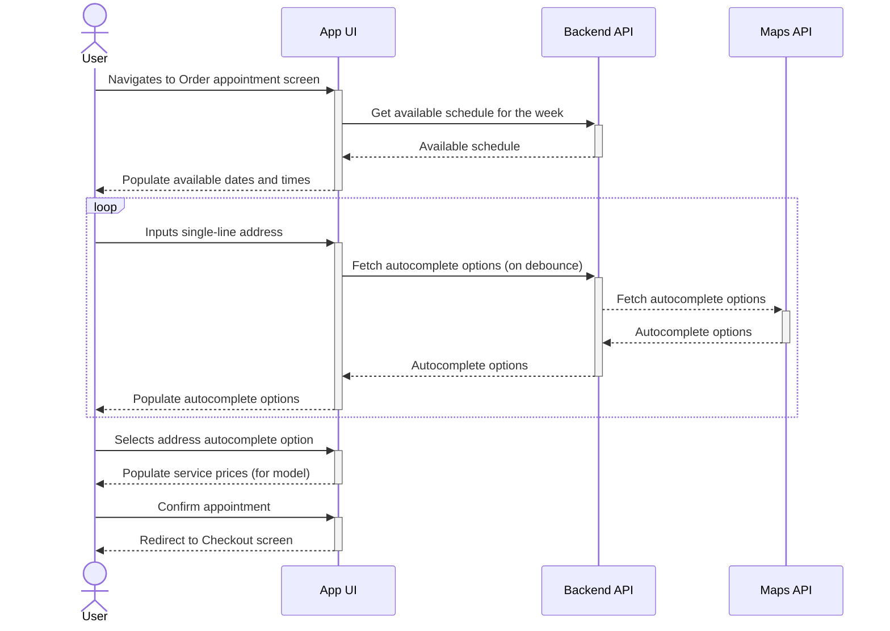

```mermaid
sequenceDiagram
    actor user as User
    participant ui as App UI
    participant backend as Backend API
    participant maps as Maps API
    
    user ->>+ ui: Navigates to Order appointment screen
    ui ->>+ backend: Get available schedule for the week
    backend -->>- ui: Available schedule
    ui -->>- user: Populate available dates and times

    loop
        user ->>+ ui: Inputs single-line address
        ui ->>+ backend: Fetch autocomplete options (on debounce)
        backend -->>+ maps: Fetch autocomplete options
        maps -->>- backend: Autocomplete options
        backend -->>- ui: Autocomplete options
        ui -->>- user: Populate autocomplete options
    end

    user ->>+ ui: Selects address autocomplete option
    ui -->>- user: Populate service prices (for model)

    user ->>+ ui: Confirm appointment
    ui -->>- user: Redirect to Checkout screen
```