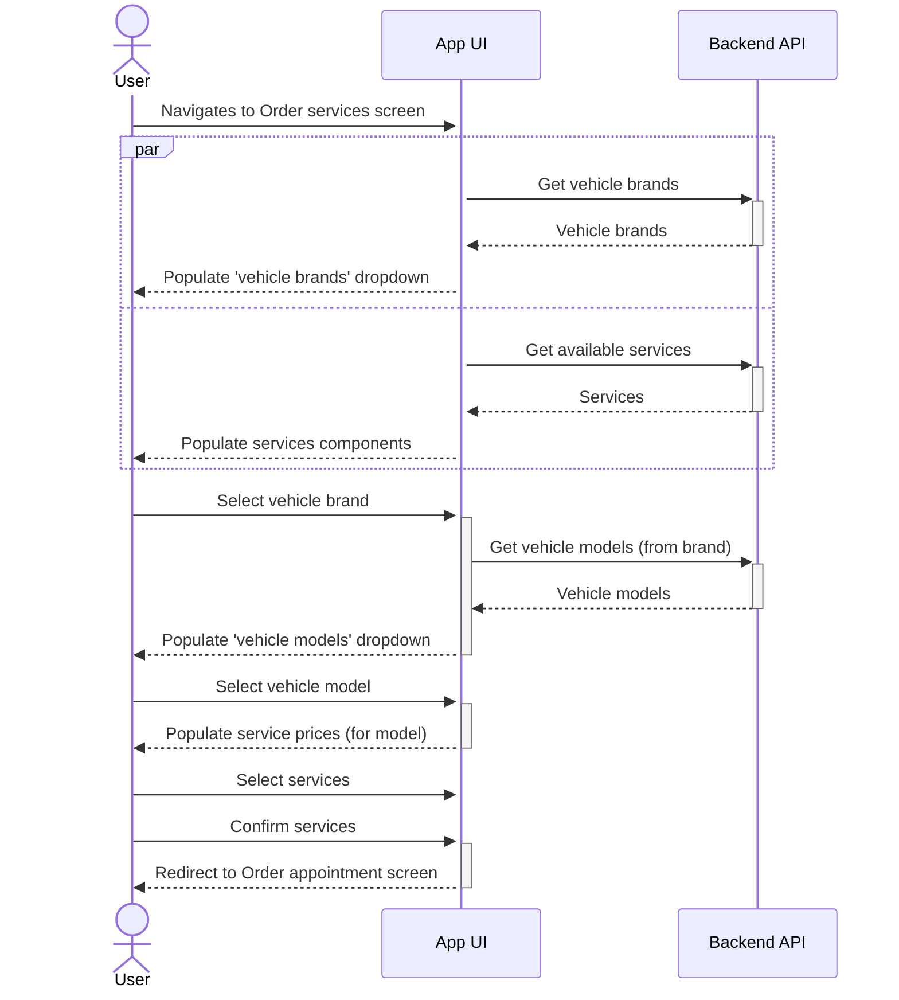

```mermaid
sequenceDiagram
    actor user as User
    participant ui as App UI
    participant backend as Backend API

    user ->>+ ui: Navigates to Order services screen

    par
        ui ->>+ backend: Get vehicle brands
        backend -->>- ui: Vehicle brands
        ui -->> user: Populate 'vehicle brands' dropdown 
    and
        ui ->>+ backend: Get available services
        backend -->>- ui: Services
        ui -->> user: Populate services components
    end

    user ->>+ ui: Select vehicle brand
    ui ->>+ backend: Get vehicle models (from brand)
    backend -->>- ui: Vehicle models
    ui -->>- user: Populate 'vehicle models' dropdown

    user ->>+ ui: Select vehicle model
    ui -->>- user: Populate service prices (for model)

    user ->> ui: Select services
    user ->>+ ui: Confirm services
    ui -->>- user: Redirect to Order appointment screen
```