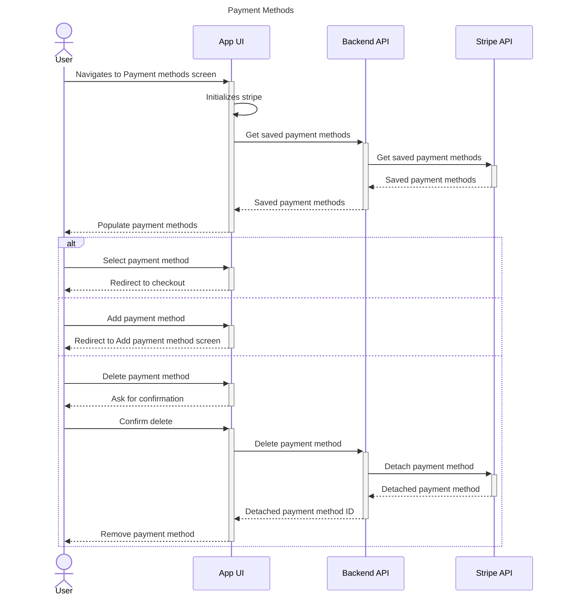

```mermaid
sequenceDiagram
    title: Payment Methods
    actor user as User
    participant ui as App UI
    participant backend as Backend API
    participant stripe as Stripe API

    user ->>+ ui: Navigates to Payment methods screen
    ui ->> ui: Initializes stripe
    ui ->>+ backend: Get saved payment methods
    backend ->>+ stripe: Get saved payment methods
    stripe -->>- backend: Saved payment methods
    backend -->>- ui: Saved payment methods
    ui -->>- user: Populate payment methods

    alt
      user ->>+ ui: Select payment method
      ui -->>- user: Redirect to checkout
    else
      user ->>+ ui: Add payment method
      ui -->>- user: Redirect to Add payment method screen
    else
      user ->>+ ui: Delete payment method
      ui -->>- user: Ask for confirmation
      user ->>+ ui: Confirm delete
      ui ->>+ backend: Delete payment method
      backend ->>+ stripe: Detach payment method
      stripe -->>- backend: Detached payment method
      backend -->>- ui: Detached payment method ID
      ui -->>- user: Remove payment method
    end
```